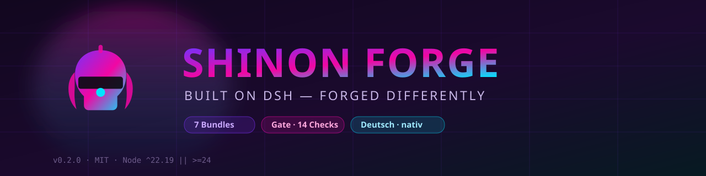

<!-- markdownlint-disable MD033 MD041 -->
<div align="center">



<br/>

<!-- STATUS BOARD — Zahlen sind hier bewusst NICHT wiederholt; Eigentümer ist docs/ZAHLEN.md -->
<a href="https://github.com/vannon091118/shinon-forge/releases"></a>&nbsp;
<a href="LICENSE"></a>&nbsp;
<a href="package.json"></a>&nbsp;
<a href="docs/INDEX.md"></a>&nbsp;
<a href="docs/ZAHLEN.md"></a>

<br/><br/>

<a href="#-quickstart"></a>&nbsp;
<a href="#-pakete"></a>&nbsp;
<a href="#-architektur"></a>&nbsp;
<a href="#-projektstatus"></a>

</div>

---

> **Status:** current — Einstieg in das Repository. **Stand:** 2026-10-10
> **Dokumentation:** `docs/INDEX.md` · **Zahlen:** `docs/ZAHLEN.md`

---

> **🇩🇪 / 🇬🇧 Dieses README ist bilingual.** Prosa-Sektionen gibt es auf Deutsch und
> Englisch; Tabellen, Baum und Statusblock gelten für beide Sprachen gemeinsam.
> **🇩🇪 / 🇬🇧 This README is bilingual.** Prose sections come in German and English;
> tables, tree and status block are shared.
>
> **Harte Zahlen stehen nicht in dieser Datei.** Sie haben genau einen Eigentümer:
> [`docs/ZAHLEN.md`](docs/ZAHLEN.md) — jede mit dem Befehl, der sie erzeugt.
> **Hard numbers do not live in this file.** They have a single owner:
> [`docs/ZAHLEN.md`](docs/ZAHLEN.md), each with the command that produces it.

---

## 🇩🇪 Was ist Shinon Forge?

**Ein Harness ist die Maschine. Shinon Forge ist das Cockpit.**

Shinon Forge ist ein unabhängiger Fork des **DeepSeek Harness (DSH)**. DSH liefert den
Kern: Agent-Loop, Tools, Sessions, Provider-Adapter, ein Plugin-System auf
**Cordis**-Basis. Wir bauen darauf die Schicht, die man tatsächlich anfasst.

Kein Neubau, kein Fremdcode, der hineingepfuscht wird. Wir besetzen DSHs eigene Slots
(`sidebar.brand.mark`, `conversation.hero.brand.mark`, `main`, `sidebar.panellist`)
statt Code zu patchen: *„Everything is a plugin."* Was DSH nicht anbietet, bauen wir
nicht daneben — wir bauen es darauf.

Ein Paket ist genau ein Ordner unter `packages/`, ein Bundle ist ein Paket mit
`dsh.bundle.patch`, und das kanonische Profil ist `profiles/shinon`. **Wie viele**
Pakete es gibt, welche davon aktiv sind und wie viele Layer das Profil hat, steht
gemessen in [`docs/ZAHLEN.md`](docs/ZAHLEN.md) — nicht in Fließtext.

## 🇬🇧 What is Shinon Forge?

**A harness is the machine. Shinon Forge is the cockpit.**

Shinon Forge is an independent fork of the **DeepSeek Harness (DSH)**. DSH provides the
core: agent loop, tools, sessions, provider adapters, a plugin system on **Cordis**.
We build the layer you actually touch on top of it.

Not a rewrite, no foreign code jammed in. We occupy DSH's own slots
(`sidebar.brand.mark`, `conversation.hero.brand.mark`, `main`, `sidebar.panellist`)
instead of patching code: *"Everything is a plugin."* What DSH does not offer, we do not
build beside it — we build on top of it.

One package is exactly one folder under `packages/`, a bundle is a package with
`dsh.bundle.patch`, and the canonical profile is `profiles/shinon`. **How many**
packages exist, which are active and how many profile layers there are is measured in
[`docs/ZAHLEN.md`](docs/ZAHLEN.md) — not in prose.

---

## ▶ Quickstart

```bash
# 1. DSH installieren (falls noch nicht da)
npm install -g @deepseek-ai/dsh          # geprüfte Fassung + Pin: docs/ZAHLEN.md §1

# 2. Dieses Repo klonen
git clone https://github.com/vannon091118/shinon-forge.git
cd shinon-forge

# 3. Wurzel-Abhängigkeiten (npm ist die einzige Paketquelle, Schritt 3.5/A1)
npm install
# 3b. Profil-Dependencies: `profiles/shinon` bindet seine Bundles mit `link:` —
#     das lehnt npm ab (gemessen: EUNSUPPORTEDPROTOCOL). Bis die Bindungsfrage aus
#     PLAN.md 3.5/3.6 entschieden ist, sind diese Links von Hand bereitzustellen;
#     der Profiltest sagt es sichtbar, wenn sie fehlen.

# 4. Prüfen, ob das Profil auflöst   → in diesem Durchlauf ausgeführt: Exit 0
                                         (Layer und Bundles: docs/ZAHLEN.md §2)
DSH_HOME=$PWD dsh --profile shinon --dump-config

# 5. Booten (Web-UI)   → in diesem Durchlauf NICHT gestartet, also hier auch nicht behauptet
DSH_HOME=$PWD dsh --profile shinon
```

Schritt 4 ist belegt (`node scripts/dsh-profile-test.mjs`, Exit 0, Zahl: `docs/ZAHLEN.md` §2).
Schritt 3 und 5 sind in diesem Durchlauf **nicht** ausgeführt worden: für Schritte, die
einen Modellschlüssel oder einen Browser brauchen, gibt es hier keinen Beleg — sie stehen
in `docs/ZAHLEN.md` §4 unter „nicht geprüft“.

---

## 🔌 Boot und Schlüssel

Das Repo-Root ist das `DSH_HOME`: dort liegt `profiles/shinon` als echtes DSH-Profil
(`package.json` mit `dsh.profile.bundles` und `cordis.patch.yml` — ein
`pnpm-workspace.yaml` führt dieses Repo nicht mehr, Schritt 3.5/A1).
Der Schlüssel gehört **nie** ins Repo — im Profil steht nur der Referenzname
(`apiKeyEnv`), das Secret kommt aus der Umgebung:

```bash
export SHINON_API_KEY="…"
DSH_HOME=$PWD dsh --profile headless "Sag nur: OK"
```

Ohne gesetzte Variable schlägt der Aufruf fail-closed fehl (beabsichtigt). Ob die
konfigurierte Route in deiner Umgebung antwortet, hängt an deinem Schlüssel und ist
deshalb **nicht** Teil der belegten Zusagen dieses Repos.

---

## 🧩 Pakete

Ein Paket ist ein Ordner unter `packages/`. Vier Rollendateien sind Pflicht
(`index.js`, `client.js`, `cordis.patch.yml`, `package.json`); zusätzlich erlaubt sind
`assets/`, `test/` und benannte Ausnahmen — die **eine** verbindliche Aussage dazu
steht in [`docs/ARCHITECTURE.md`](docs/ARCHITECTURE.md) §2.

| Paket | Rolle | Profil |
|---|---|---|
| **[@shinon/core](packages/core)** | Branding-Overlay: Sidebar- und Hero-Marke, Farbverlauf, Pulse | ✅ |
| **[@shinon/persona](packages/persona)** | Shinon als Persona-Schicht im DSH-System-Prompt | ✅ |
| **[@shinon/locale-de](packages/locale-de)** | Deutsche Sprache, Namespace `shinon` | ✅ |
| **[@shinon/tooltip](packages/tooltip)** | Styles für erweiterte Tooltips (keine Tooltip-Logik) | ✅ |
| **[@shinon/events](packages/events)** | Hook/Event-Spine: beobachten, normalisieren, validieren, emittieren | ✅ |
| **[@shinon/hook](packages/hook)** | Event-Beobachtung auf der Host-Seite, Replay-Fixture | ✅ |
| **[@shinon/markers](packages/markers)** | Marker-Spiegel (Brutalord-Regeln) im nativen Side Panel | ✅ |
| **[@shinon/dashboard](packages/dashboard)** | Status-Panel; liest die echten `workspaces`/`sessions`-Dienste | ✅ |
| **[@shinon/prompter](packages/prompter)** | One-Shot Prompt-Enhancer am `agent/pre-step` (Route im Profil leer) | ✅ |
| **[@shinon/task-router](packages/task-router)** | liest die validierte Klassifikation des Enhancers | ✅ |
| **[@shinon/project-index](packages/project-index)** | persistenter Projektindex (files, symbols, edges, FTS) außerhalb des Repos | ✅ |
| **[@shinon/codingmon](packages/codingmon)** | Pet-/Kampf-System mit dauerhaftem Zustand und Client→Host-Naht | ✅ |
| **[@shinon/key-router](packages/key-router)** | Key-Pool mit 429-Rotation und Eskalationszeiten | — |
| **[@shinon/narrative](packages/narrative)** | Chronicle, Arcs, Relationships, Composite State | — |
| **[@shinon/shinon-forge](packages/shinon-forge)** | Memory Sync, Global Runner, Engine Adapters | — |
| **[@shinon/better-errors](packages/better-errors)** | Config-Ebene ohne Logik: `apply()` loggt nur | ✅ |
| **[@shinon/token-usage](packages/token-usage)** | Platzhalter: Client rendert unabhängig von der Config | ✅ |
| **[@shinon/openapi](packages/openapi)** | Vertrag (`openapi.yaml`) vorhanden, **kein** Server — bewusst nicht aktiviert | — |
| **[@shinon/popup](packages/popup)** | zeigt Original/Ergebnis/Prozess im `conversation.composer.dock` | — |

Die Spalte „Profil“ ist gemessen aus `profiles/shinon/package.json` (Zahl: `docs/ZAHLEN.md` §1).
Fünf Pakete stehen nicht darin (`key-router`, `narrative`, `openapi`, `popup`,
`shinon-forge`) — bei `openapi` ist das eine dokumentierte Entscheidung
(`docs/ARCHITECTURE.md` §4); für die übrigen vier ist in diesem Baum **kein** Grund
verzeichnet. Alle 19 Pakete sind eingecheckt; ob ein Paket aktiv ist, entscheidet
allein `dsh.profile.bundles` im Profil.

---

## 🛠 Architektur

```text
                    ┌─────────────────────────┐
                    │          DSH            │   Runtime: Loop, Tools,
                    │  (Agent = Model+Harness)│   Sessions, Provider, Cordis
                    └────────────┬────────────┘
                                 │  Slots · Events · Bundles
                    ┌────────────▼────────────┐
                    │      SHINON FORGE       │   Overlay: Brand, Sprache,
                    │   @shinon/* Bundles     │   UI-Schichten, Governance
                    └────────────┬────────────┘
                                 │
        ┌────────────────────────┼────────────────────────┐
        ▼                        ▼                        ▼
   Governance               Branding                  Schichten
   scripts/gate/            packages/core             locale-de, tooltip,
   Gates + Slices           Slots statt Patches       dashboard, events …
```

**Regel:** DSH ist die Laufzeit, wir bauen Schichten darauf — kein zweiter Kernel
daneben. Verbindlich: [`docs/ARCHITECTURE.md`](docs/ARCHITECTURE.md).

---

## 📊 Projektstatus

Statusklassen — und was sie hier bedeuten:

- **Verified** — in **diesem** Durchlauf (2026-10-10) ausgeführt und **Exit 0 gesehen**.
- **Rot** — in diesem Durchlauf ausgeführt und **nicht** Exit 0; der Befund steht in
  [`docs/ZAHLEN.md`](docs/ZAHLEN.md) §3.
- **Nicht geprüft** — kein Exit-0-Beleg aus diesem Durchlauf (auch wenn es früher lief).

| Bereich | Status 2026-10-10 | Beleg |
|---|---|---|
| Namensvertrag, Manifeste, Syntax, Legacy-Guard, Ressourcen, Komposition | **Verified** | `node scripts/dsh-test.mjs` → Exit 0 |
| Regel-Fixtures (Gate **und** Build müssen rot werden) | **Verified** | `node scripts/validate-test.mjs` → Exit 0 |
| Profil `profiles/shinon` auflösbar (alle Layer, alle eigenen Bundles) | **Verified** | `node scripts/dsh-profile-test.mjs` → Exit 0 |
| Marker-Regeln in Vertrag + Host + Client | **Verified** | `node --test scripts/gate/tests/markers.test.mjs` → Exit 0 |
| Event-Spine gegen die eingefrorene Fixture | **Verified** | `node --test scripts/gate/tests/events-spine.test.mjs` → Exit 0 |
| Codemon-Kernmathematik, Kompositor-Regel, Client-Durchstich im vm | **Verified** | `npm run test:codingmon` → Exit 0 (überspringt sichtbar, was DSH-Bausteine braucht) |
| Distributionstest (`npm pack` → Isolat → Load) | **Verified** (76 von 76) | `node scripts/pack-test.mjs` → Exit 0 |
| Web-UI-Boot in Chromium + Panel-Beleg | **Verified** (7 von 7) | `dsh --profile shinon` + `node scripts/panel-check.mjs --url … --token …` → Exit 0 |
| Gate-Engine `--full` | **Verified** (18 von 18; gehaltene Versionsaufteilung ist deklariert, Undeklariertes bleibt rot) | `npm run gate:full` → Exit 0 |
| Gate-Tests (reine Gate-Logik) | **Verified** (327 von 327; braucht Node ≥ 22 und Repo-`dsh` zuerst im PATH — Details: `docs/ZAHLEN.md` §2) | `node --test scripts/gate/tests/*.test.mjs` → Exit 0 |
| Volle Kette | **Verified** (32 → 99 → 9 → 76 → 3 grün, ohne `pnpm` und ohne globales `dsh` im PATH) | `npm test` → Exit 0 |
| Echter Modellaufruf | **Nicht geprüft** | `docs/ZAHLEN.md` §4 |

Zählungen, Exit-Codes und die Ursachen jedes roten Befunds stehen **nur** in
[`docs/ZAHLEN.md`](docs/ZAHLEN.md) §2/§3.

---

## ⚙ Build & Test

Alle Einträge aus `package.json` (`scripts`), in der Reihenfolge, in der man sie braucht:

| Befehl | Wirkung |
|---|---|
| `npm test` | Volle Kette: Codingmon-Tests → Gate → Fixtures → Distribution → Profil (stoppt beim ersten Fehler) |
| `node scripts/dsh-test.mjs` | statisches Gate: Manifest, Namensvertrag, `index.js`, `client.js`, `cordis.patch.yml`, Legacy-Guard, Quell-Zwillings-Drift, Profil |
| `node scripts/validate-test.mjs` | Regel-Fixtures: jede Regel muss Gate **und** Build rot werden |
| `node scripts/pack-test.mjs` | Distribution je Paket: `npm pack` → entpacken → isoliert installieren → laden |
| `node scripts/dsh-profile-test.mjs` | Profiltest: `dsh --profile shinon --dump-config`, alle Layer |
| `npm run gate` / `gate:local` / `gate:full` | modulare Gate-Engine (Slices / lokal / alle Gates) |
| `npm run gate:test` | reine Gate-Logik (kein DSH nötig) |
| `npm run test:codingmon` / `test:hook` | paketlokale Tests |
| `npm run build` | regeneriert `dist/` (Manifest, Profil, Paketkopien) |
| `npm run dev` / `dev:web` / `open` | DSH mit dem Profil starten (Web-UI) |
| `npm start [-- …]` · `shinon [-- …]` | der Einstieg ([`bin/shinon.mjs`](bin/shinon.mjs), auch als `bin`-Feld im Manifest): heilt Node ≥ 22 selbst, findet `dsh` auch außerhalb des PATH und **nennt dessen Herkunft**, startet das Profil; `--check` prüft nur die Startfähigkeit. `scripts/start.mjs` bleibt als kompatibler Aufruf und importiert dieselbe Umsetzung |
| `npm run verify:panel` | Panel-Beleg über `scripts/panel-check.mjs` (braucht jsdom) |
| `npm run stages` | Startstufen/Ready-Zeile aus `scripts/open.mjs` nachvollziehen |
| `npm run commit:guard -- …` | Commit-Regeln prüfen (`--ci`, `--last n`, `--range`, `--all`) |
| `npm run hooks:install` | Git-Hooks aktivieren (einmal pro Klon) |
| `npm run update` | echte Registry-Prüfung (Maximum nach Semver) ins kanonische Profil; offline UNGEPRÜFT statt „keine Updates"; Install-Pfad live ungeprüft |
| `npm run sync` | derzeit ohne Funktion: braucht ein `upstream`-Remote, das nicht eingerichtet ist (`git fetch upstream` → Exit 128) |
| `npm run desktop:launcher` | Desktop-Starter (Konzept, siehe [`docs/STARTER-PLAN.md`](docs/STARTER-PLAN.md)) |

---

## 🗺 Offene Arbeit (gemessen, nicht gewünscht)

- **Rote Prüfläufe beheben** — Reihenfolge und Ursachen: [`docs/ZAHLEN.md`](docs/ZAHLEN.md) §3.
  Einer ist Umgebungsarbeit (`schemastery` fehlt im Root, deshalb wird
  `codingmon-store` rot statt zu überspringen), einer ist ein bewusstes Verhalten
  (`message-ingress` verweigert die Zusage gegen eine ungeprüfte DSH-Fassung).
- **Versionsangleich der Pakete** (16× `1.0.0`, 3× `0.1.0`) — deshalb meldet `doctor` Drift.
- **Fünf nicht aktivierte Pakete** (`key-router`, `narrative`, `openapi`, `popup`,
  `shinon-forge`): entscheiden, ob sie ins Profil kommen. Alle fünf sind gebaut und
  laden im Distributionstest; keines ist vergessen, aber keines ist aktiv.
- **Native App** (Stufe 1 scharf, 2–4 Konzept): [`docs/STARTER-PLAN.md`](docs/STARTER-PLAN.md).
- **Belege nachziehen**, wo nur ältere Messungen existieren: `docs/probes/` nennt je
  Probe sein Datum.

---

## 📚 Struktur

```text
Shinon-forge/
├── packages/                  # jedes Paket = ein Ordner: @shinon/<ordner>  (Anzahl: docs/ZAHLEN.md §1)
│   ├── core/ persona/ locale-de/ tooltip/ events/ hook/ markers/ dashboard/
│   ├── prompter/ task-router/ project-index/ codingmon/ key-router/ narrative/
│   ├── shinon-forge/ better-errors/ token-usage/
│   └── openapi/ popup/        # bewusst nicht im Profil
├── profiles/
│   ├── shinon/                # kanonisches Profil (dsh.profile.bundles, cordis.patch.yml)
│   ├── headless/              # One-shot-Profil (Modell-Route)
│   └── web/                   # Altbestand: nur fremde Bundles, kein @shinon/*
├── docs/
│   ├── INDEX.md               # Einstieg + Statusregel für jedes Dokument
│   ├── ZAHLEN.md              # einziger Eigentümer aller harten Zahlen
│   ├── ARCHITECTURE.md        # Namespace, Paketgrenzen, Profil-Vertrag
│   ├── COMMIT-REGELN.md       # Commit-Regeln und Durchsetzung
│   ├── STARTER-PLAN.md        # native App (plan)
│   ├── PLAN.md · FOUNDATION-PLAN.md · REPO-ANALYSIS.md · SYSTEM-ANALYSIS.md   # historical
│   ├── contracts/             # Verträge (JSON, mit Statusfeld)
│   ├── probes/                # Falsifikations-Proben (JSON, mit Datum)
│   └── legacy-goose-prompts/  # importierte Fremdtexte
├── IDEA.md · shinon-forge-implementierungsplan.md   # plan bzw. historical (Statusblock im Kopf)
├── scripts/                   # Gate-Engine, Build, Tests, Helfer (gate/, lib/, *.mjs)
├── prompts/ · assets/banner.svg
└── profiles/shinon/          # out-of-tree-Profil (package.json, cordis.patch.yml, cordis.yml)
```

Jede Datei in `docs/` trägt einen Statusblock; die vollständige Liste steht in
[`docs/INDEX.md`](docs/INDEX.md) §3.

---

## 🔗 Referenzen (extern, hier nicht geprüft)

- [DSH Architektur](https://github.com/deepseek-ai/deepseek-harness/blob/master/docs/architecture.md)
- [Schemastery Config](https://github.com/deepseek-ai/deepseek-harness/blob/master/docs/user/develop/basic/config.md)
- [Locale Plugin](https://github.com/deepseek-ai/deepseek-harness/blob/master/packages/client/locale/README.md)
- [Plugin Manager](https://github.com/deepseek-ai/deepseek-harness/blob/master/docs/user/develop/basic/publish.md)

---

<div align="center">

**Powered by DSH. Developed by a solo dev on an FX-6300.**

`@shinon/*` · MIT · Node-Fassung und alle weiteren Zahlen: `docs/ZAHLEN.md` §1

</div>
